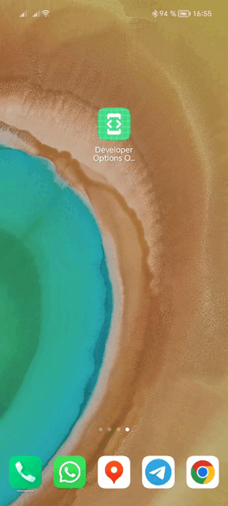

# Developer_Options_Opener
Открывает меню разработчика одним нажатием. Можно добавить плитку в быстрые настройки.

Huawei не позволяет добавлять в быстрые настройки плитки функций меню разработчика (как беспроводная отладка). Лучший 
альтернативный вариант - открывать меню разработчика программно. Данное приложение при запуске именно это и делает.
Можно добавить плитку запуска в быстрые настройки, тогда не нужно держать ярлык приложения на домашнем экране.

